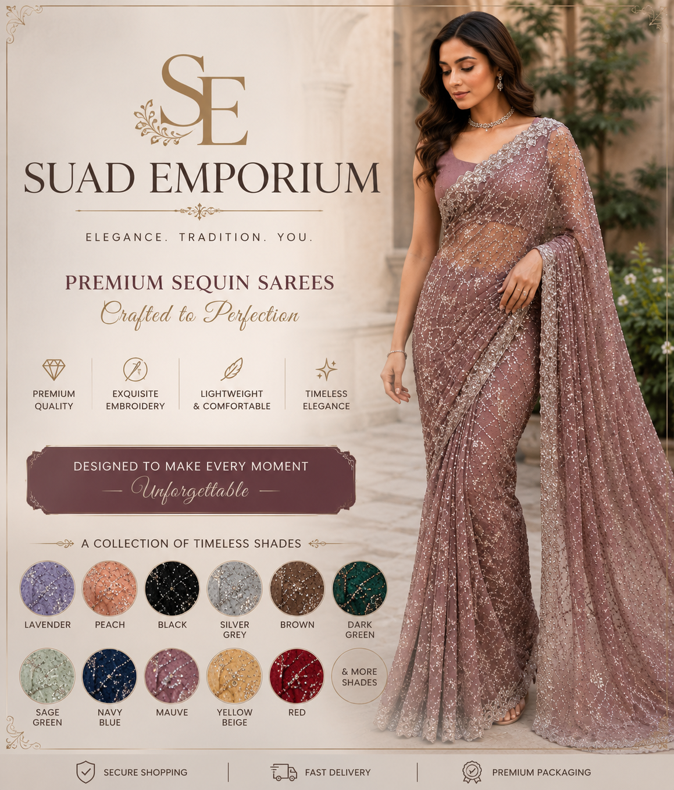

# 🛍️ Saud Emporium

### Premium Ladies Fashion — Sarees, Suits, Maxi & Jewelry

---

### 🏷️ Official Project of Nexora Technologies

---

**Saud Emporium** is a full-stack e-commerce storefront for premium ladies' fashion — **Sarees, Suits, Maxi Dresses, and Jewelry** — built end-to-end by **Nexora Technologies** as our very first client delivery. It covers the complete customer journey: browsing curated collections, managing a cart and wishlist, secure checkout, and manual payment confirmation via EasyPaisa — backed by a production-ready **PERN**-style architecture and search-engine-ready SEO foundations.

-----

### 🧱 Techstack

----

---

## ✨ Features

### 🛒 Shopping Experience

-----

- Category-wise browsing — **Sarees, Suits, Maxi, Jewelry, New Arrivals, Collections**
- Product detail pages with **size / color / variant** selection
- Persistent **Cart** & **Wishlist**, synced per logged-in user
- Guest-friendly browsing with auth-gated checkout

### 🔐 Authentication & Accounts

----

- JWT-based authentication (register/login) with **bcrypt** password hashing
- Protected routes via token-verification middleware
- Profile update & change-password flows

### 📦 Orders & Checkout

---

- Multi-item order placement with full shipping details
- **EasyPaisa** manual payment flow with a dedicated payment-instructions screen
- Order history per user, with cart auto-clear on successful checkout

### 🔎 SEO & Discoverability

---

- Full **Open Graph** & **Twitter Card** meta tags for rich social sharing
- `sitemap.xml` and `robots.txt` for crawler indexing
- **Google Search Console** verified (site ownership file included)
- `react-helmet-async` for dynamic, per-page meta management

### 🗂️ Data & Admin Management

----

- **PostgreSQL** (via **Supabase**) as the system of record for products, users, carts, wishlists & orders
- Order lifecycle (`pending → processed → fulfilled`) manageable from the backend/Supabase layer — acting as a lightweight **CRM** for order & customer management
- Centralized error handling & response-caching headers on the API layer

---

## 🏢 Built By

---

**Nexora Technologies**
*Digital Solutions & AI Agency — Karachi*

Saud Emporium was Nexora's **first client project** — laying the foundation for everything we've built since.

---

## 📄 License

This project is proprietary and built exclusively for **Saud Emporium**. All rights reserved by Nexora Technologies.
